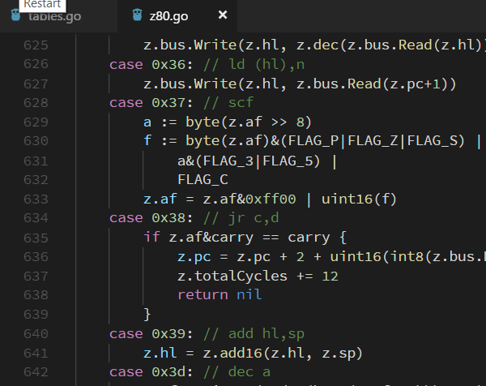

# vscode-hoverhex 

Hoverhex displays the decimal value of any valid hex number that the mouse is hovering.

## Features

Quickly know the decimal value of a hexadecimal string

> Hoverhex is configured to work on any document

### 0.0.2 - 2018.05.09

Fixed a typo
Added travis build badge

### 0.0.1 - 2018.05.08

Initial release

**Enjoy!**

https://github.com/thegtproject/vscode-hoverhex