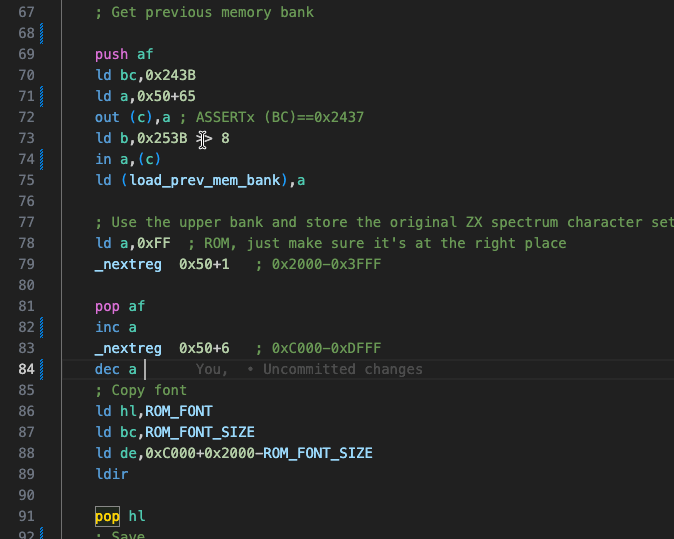
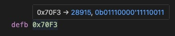
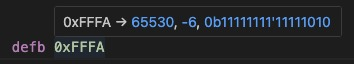
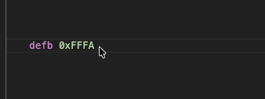
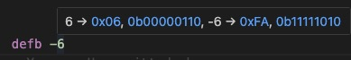
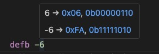
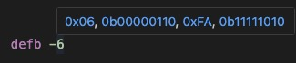

# Support
If you like the "Hex Hover Converter," please consider supporting it.

&nbsp;&nbsp;

# Hex Hover Converter

The "Hex Hover Converter" displays numbers in their decimal, hexadecimal, and binary formats.
Simply hover your mouse over a number to see the conversion.
Conversions work in all directions: decimal to hexadecimal and binary, hexadecimal to decimal and binary, and so on.

Version 2.0 introduces a more compact display and full customization of the output.
Additionally, the content is now clickable, allowing you to easily replace the hovered number with the converted value.

# Customizations
You can customize the appearance of the hovers globally ("User") or per workspace.
For each type of conversion (decimal to hex/binary, hex to decimal/binary, or binary to decimal/hex), you can define a different format string.
If you don't want a particular conversion to appear (e.g., you don't want the binary conversion line), simply clear the line.

For example, the default format string for hexadecimal conversion is:
~~~
0x{hex} → <{dec}>, <0b{bin}>\n
~~~

The **curly brackets** {...} contain variables representing the hovered value as:
- `{hex}`: hexadecimal value
- `{dec}`: decimal value
- `{bin}`: binary value

When hovering, the above line could expand to:

Please note that `{dec}` is special, as it can represent both positive and negative values at the same time.
When converting hex values, it is not always clear whether the result should be positive or negative. In such cases, both values are shown.
Here is an example:

Additionally, two more variables exist:
- `{decu}`: unsigned decimal value (always positive)
- `{deci}`: decimal value (may be negative or positive)

The **angle brackets** <...> are used to make the enclosed text clickable. If you click the text, it will replace the hovered value, making it easy to swap the value with its converted form.

## More Examples
You can customize the character used to separate different conversion strings with the `format.stringSeparator` setting.
By default, this is set to the newline character `\n`, which displays each conversion on a separate line.
However, you can change it to something like `, ` to show all conversions in a single line.
For example:

Instead of:

For an even more compact display, you can e.g. remove the source values completely from the format strings:
~~~json
formatString.decimal = "<0x{hex}>, <0b{bin}>"
formatString.signedDecimal = "<0x{hex}>, <0b{bin}>"
~~~

# Remarks
- Conversion of negative values: Negative numbers are converted using two's complement. Values are sign-extended to the next byte, word, or dword boundary before conversion. For example, "-6" becomes "0xFA" in hexadecimal, and "-32766" becomes "0x8002", and vice versa.
- Hovers in Debug Mode: VS Code disables normal hovers in debug mode. To make them visible, press the "ALT" key while hovering.

# License and Acknowledgements
This extension is based on https://github.com/thegtproject/vscode-hoverhex by [Brandon/thegtproject](https://github.com/thegtproject) and was originally a pull request.
However, the original project appears to be abandoned.
As it is MIT licensed, I decided to use the extension skeleton from the original project and enhance the simple hex conversion into a more advanced decimal-hex-binary conversion in all directions.

This extension is also MIT licensed.
